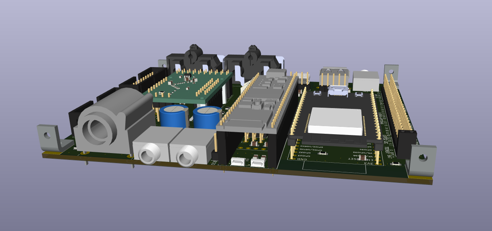
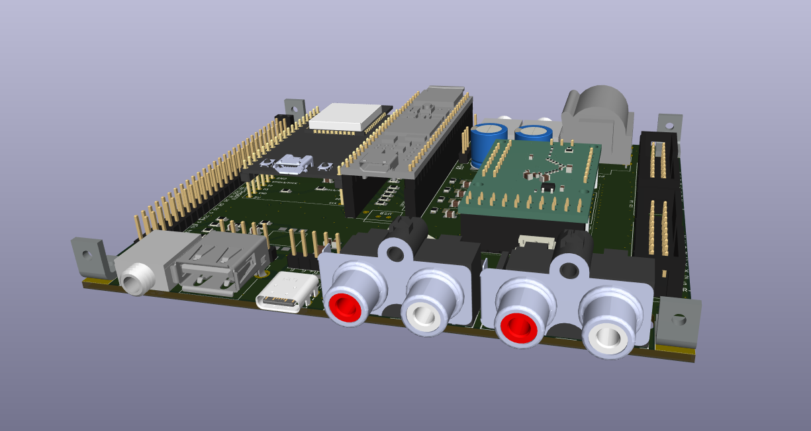
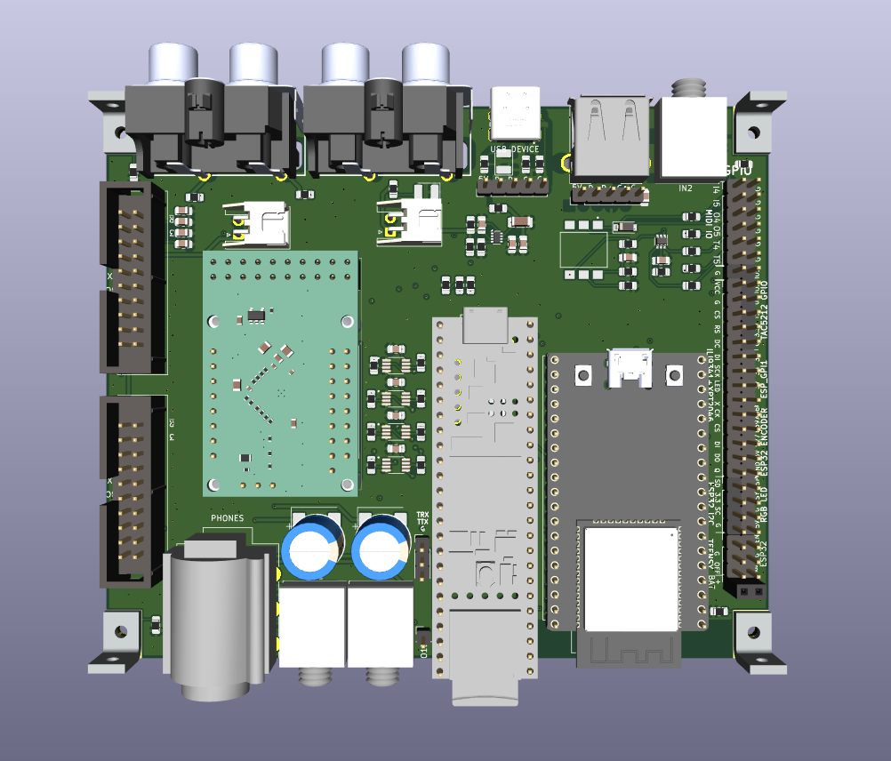
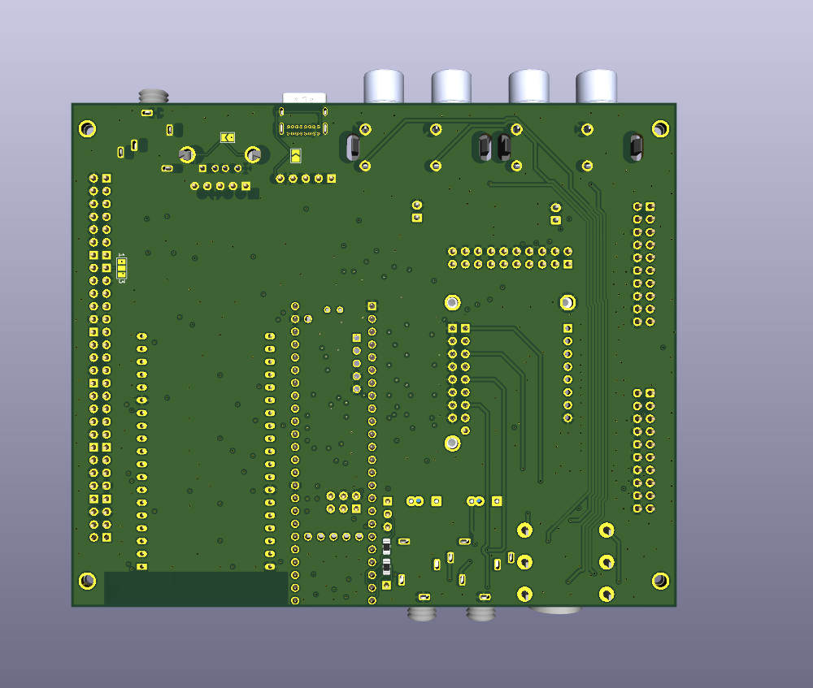
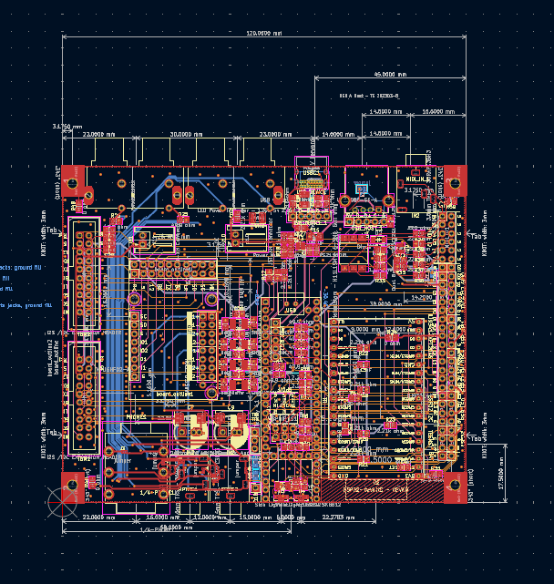

# T-DSP Desktop Pro

**Part of the [T-DSP](https://t-dsp.com) open modular audio platform.**

A desktop audio backplane (100mm x 120mm) that serves as the central hub for the T-DSP modular audio ecosystem. Hosts a Teensy 4.1, ESP32, and T-DSP TAC5212 pro audio codec module on an 8-layer PCB designed for studio-quality signal integrity.

## About T-DSP

T-DSP is an open modular audio platform designed for musicians, engineers, and developers who want powerful digital signal processing in a flexible, hackable format. Built around the [Teensy](https://www.pjrc.com/teensy/) microcontroller and the [Teensy Audio Library](https://www.pjrc.com/teensy/td_libs_Audio.html), T-DSP combines studio-quality audio with a growing library of open-source modules for mixing, synthesis, effects, and more.

Whether you're building a custom digital mixer, crafting a unique instrument, or prototyping audio products, T-DSP gives you the tools to bring your ideas to life.

Join the community, contribute to the library, or grab a module and start patching. Learn more at [t-dsp.com](https://t-dsp.com).

## Overview

The Desktop Pro is a **backplane PCB** that hosts a Teensy 4.1, ESP32, and T-DSP codec module alongside supporting ICs to create a complete audio development platform. It provides all the connectors, processing, networking, and user interface needed to build desktop audio devices.

## Processing

- **Teensy 4.1** -- ARM Cortex-M7 running the Teensy Audio Library for real-time audio processing (mixing, effects, synthesis, routing). Also receives USB Audio.
- **ESP32** -- UI controller, WiFi/Bluetooth connectivity. Runs the display, buttons, and encoder, and sends commands to the Teensy over serial.
- **T-DSP TAC5212 Module** -- Professional stereo audio codec (ADC + DAC) with mic preamp, line, and instrument inputs

## On-Board ICs

| Ref | Part | Function |
|-----|------|----------|
| U1 | Teensy 4.1 | Audio DSP (ARM Cortex-M7) |
| U2 | ESP32-DevKitC | UI controller, WiFi/Bluetooth |
| U3 | TPS2116DRL | Power multiplexer (dual input selection) |
| U4 | H11L1SM | Optoisolator (MIDI input) |
| U5-U8 | SN74LVC2G125DCTR | Dual bus buffers (4x) |
| U9 | 74HCT2G17GW | Dual Schmitt trigger buffers (3x) |

## Audio Connectivity

### Analog I/O
- **3.5mm TRS jacks** -- Stereo audio inputs and outputs
- **6.35mm (1/4") phone jack** -- Headphone/monitor output (16-300 ohm)
- **MIDI I/O** -- 3.5mm TRS MIDI input and output with optical isolation (H11L1)

### Digital I/O
- **S/PDIF** -- Digital audio input and output
- **USB-C or USB-B** -- Teensy device/programming interface (shared footprint, populate one)
- **USB-A** -- USB host connector

## Expansion

- **2x TDM expansion headers** (2x10 pin, 2.54mm) -- Connect T-DSP audio modules
  - TDM digital audio bus (BCLK, LRCK, DATA_IN, DATA_OUT, MCLK)
  - I2C control bus (SDA, SCL)
  - Power rails (5V, 12V, GND)
- Modules can be soldered directly or socketed with pin headers
- Multiple modules can be chained on the same TDM bus

## User Interface

- **Tactile buttons** (SW1-SW8) for control and navigation
- **Rotary encoder** for parameter adjustment and menu navigation
- **OLED display** (128x64, SSD1306) for status and menus
- **3.2" TFT touchscreen** (ILI9341) header for advanced UI (optional)
- **SK6812 addressable LEDs** for visual status indication

## Board Design

- **8-layer PCB** with dedicated ground and power planes for low-noise analog performance
- **100mm x 120mm** board dimensions
- LDO voltage regulation for clean analog power
- Buffered digital outputs for reliable module distribution
- Separate analog and digital ground domains

## Project Files

| Directory | Contents |
|-----------|----------|
| `/3d_models/` | 3D models for PCB components |
| `/bom/` | [Interactive BOM](https://t-dsp.github.io/t-dsp_desktop_pro/bom/ibom.html) and bill of materials |
| `/documentation/` | [Schematic PDF](documentation/t-dsp-desktop-pro-schematic.pdf), board images, and reference docs |
| `/gerbers/` | Manufacturing-ready Gerber output files |
| `/lib_fp/` | Custom KiCad footprint libraries |
| `/lib_sch/` | Custom KiCad schematic symbol libraries |
| `/panel/` | Panelized board layouts for production |

## Status

This board is under active development. The current revision addresses analog output stage redesign for low-impedance headphone drive and signal routing improvements from earlier prototypes.

If you build one, we'd love to hear how it goes -- please open an issue or reach out with your findings.

## Contact

For consulting, custom backplane design, or commercial licensing inquiries, reach out via [LinkedIn](https://linkedin.com/in/jayshoe).

## License

This project is licensed under the [Creative Commons Attribution-NonCommercial-ShareAlike 4.0 International (CC BY-NC-SA 4.0)](https://creativecommons.org/licenses/by-nc-sa/4.0/).

You are free to share and adapt this work for non-commercial purposes, as long as you give appropriate credit and distribute any derivatives under the same license.
